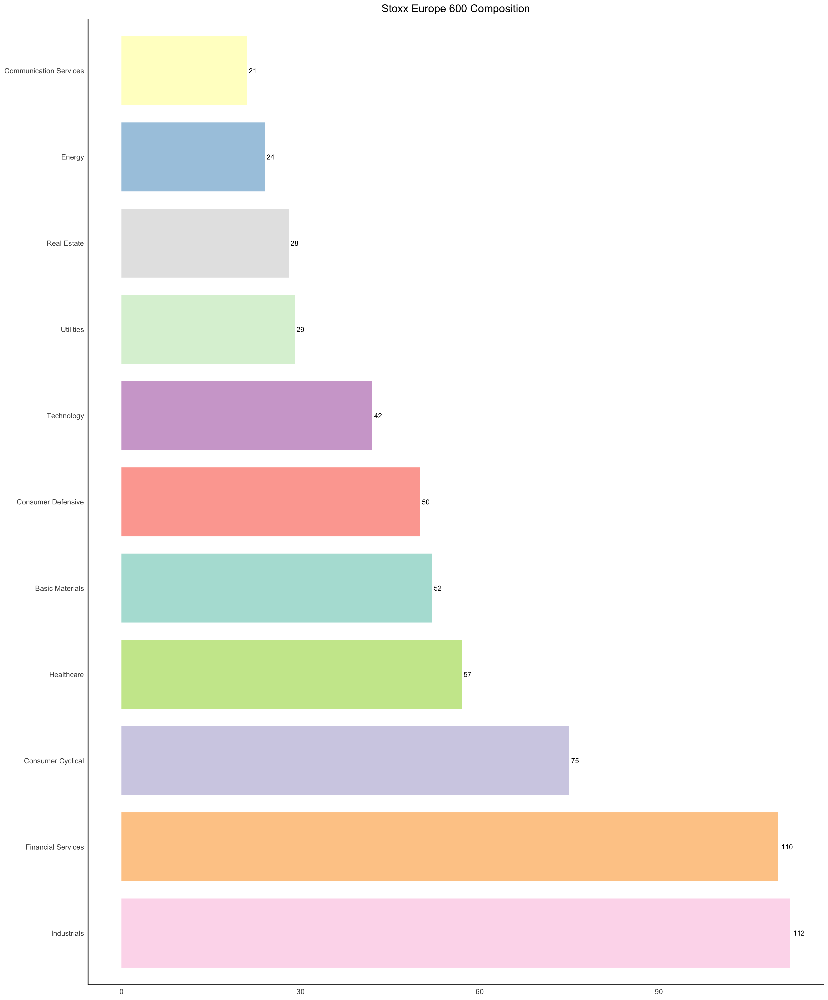

# stockScreener

Stock Screener attempts to screen for stocks using tidyquant.

## Inputs
### STOXX Europe 600

The STOXX Europe 600, also called STOXX 600, SXXP, is a stock index of 600 components representing large, mid and small capitalization companies among 17 European countries, covering approximately 90% of the free-float market capitalization of the European stock market (not limited to the Eurozone).

### CAC40

The CAC 40 is a benchmark French stock market index. The index represents a capitalization-weighted measure of the 40 most significant stocks among the 100 largest market caps on the Euronext Paris.